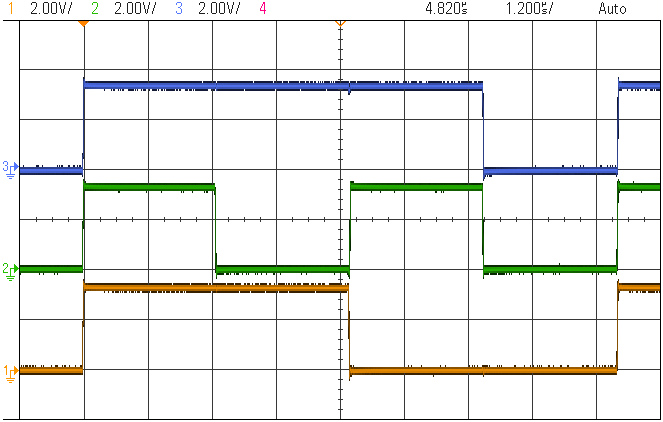
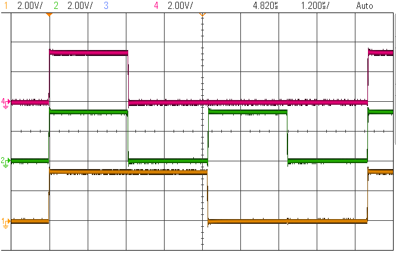
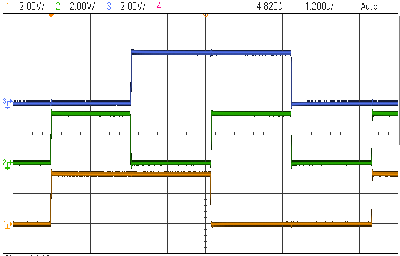

 <article class="markdown-body entry-content p-3 p-md-6" itemprop="This needs to locked down and 'never' changed">

# PIC18F47Q10: Getting started with the CLC on PIC18 -> Using Basic Logic Gates -> Bare metal code

## Objective:
The PIC18F47Q10 features 8 Configurable Logic Cell (CLC) peripherals that cen be used to implemenmt various logic functions.
In this demo, the internal timers and PWMs are used to generate internal signals that are then connected to CLCs to implement basic logic gates.
Three use cases are implemented : AND, OR and XOR.

## Related Documentation
Existing application notes or tech briefs that are related to the subject:
- [TB3273 - Getting Started with CLC on PIC18](https://www.microchip.com/wwwappnotes/appnotes.aspx?appnote=en1002950)
- [AN2133 - Extending PIC® MCU Capabilities Using CLC](http://ww1.microchip.com/downloads/en/AppNotes/00002133a.pdf)
- [TB3133 – Configurable Logic Cell on PIC® Microcontrollers](http://ww1.microchip.com/downloads/en/Appnotes/90003133A.pdf)
- [AN2805 - Robust Debouncing with Core Independent Peripherals](http://ww1.microchip.com/downloads/en/DeviceDoc/AN2805-Robust-Debounc-Core-Inddep-Periph-DS00002805A.pdf)
- [DS41631B - Configurable Logic Cell Tips ’n Tricks](http://ww1.microchip.com/downloads/en/devicedoc/41631b.pdf)
- [AN2912 - Using CLCs in Real-Time Applications](http://ww1.microchip.com/downloads/en/Appnotes/AN2912-Using-CLCs-in-Real-Time-Apps_00002912A.pdf)
- [AN1606 - Using the Configurable Logic Cell (CLC) to Interface a PIC16F1509 and WS2811 LED Driver](http://ww1.microchip.com/downloads/en/appnotes/00001606a.pdf)

- [20007 CIP1 - Applying Configurable Logic Cell CLC to Interconnect Peripheral Functions](https://www.youtube.com/watch?v=qT2Ma_XR3ZQ)

- [PIC18F-Q10 Family Product Page](https://www.microchip.com/design-centers/8-bit/pic-mcus/device-selection/pic18f-q10-product-family)
- [PIC18F47Q10 Data Sheet](http://ww1.microchip.com/downloads/en/DeviceDoc/40002043D.pdf)
- [PIC18F47Q10 Code Examples on GitHub](https://github.com/microchip-pic-avr-examples?q=pic18f47q10-cnano&type=&language=)
- [TB3261 - PIC1000: Getting Started with Writing C-Code for PIC16 and PIC18](https://www.microchip.com/wwwappnotes/appnotes.aspx?appnote=en1002117)

## Software Used
- MPLAB® X IDE 5.30 or newer [(microchip.com/mplab/mplab-x-ide)](http://www.microchip.com/mplab/mplab-x-ide)
- MPLAB® XC8 2.10 or a newer compiler [(microchip.com/mplab/compilers)](http://www.microchip.com/mplab/compilers)
- MPLAB® Code Configurator (MCC) 3.95.0 or newer [(microchip.com/mplab/mplab-code-configurator)](https://www.microchip.com/mplab/mplab-code-configurator)
- MPLAB® Code Configurator (MCC) Device Libraries PIC10 / PIC12 / PIC16 / PIC18 MCUs [(microchip.com/mplab/mplab-code-configurator)](https://www.microchip.com/mplab/mplab-code-configurator)
- Microchip PIC18F-Q Series Device Support (1.4.109) or newer [(packs.download.microchip.com/)](https://packs.download.microchip.com/)

## Hardware Used
- PIC18F47Q10 Curiosity Nano [(DM182029)](https://www.microchip.com/Developmenttools/ProductDetails/DM182029)

## Setup
The following configurations must be made for this project:
- Timer 2 frequency = 100 kHz (10 us period)
- Timer 4 frequency = 200 kHz (5 us period)
- PWM3 has as source Timer2 and duty-cycle = 50%
- PWM4 has as source Timer4 and duty-cycle = 50%
- CLC1 is set up as AND-OR: used as 2 input OR
- CLC2 is set up as 4-input AND: used as 2 input AND
- CLC3 is set up as OR-XOR: used as 2 input XOR

I/O configurations:

|Pin           | Configuration      |
| :----------: | :----------------: |
|RA2           | Digital Output     |
|RA3           | Digital Output     |
|RC2           | Digital Output     |
|RC3           | Digital Output     |
|RB0           | Digital Output     |

This setup will create an internal connection as depicted:

 

## Operation
Run the code written in Bare metal, the following signals are to be seen on the oscilloscope:

In the figure below it is depicted the input and output signals of CLC1, as it performs the OR logic function:
- Signal 1 (Yellow) is PWM3 output used as CLC1 Input A
- Signal 2 (Green) is PWM4 output used as CLC1 Input B
- Signal 3 (Blue) is CLC1 output (logic OR between PWM3 and PWM4)

 

In the figure below it is depicted the input and output signals of CLC2 as it performs the AND logic function:
- Signal 1 (Yellow) is PWM3 output used as CLC2 Input A
- Signal 2 (Green) is PWM4 output used as CLC2 Input B
- Signal 4 (Red) is CLC2 output (logic AND between PWM3 and PWM4)

 

In the figure below it is depicted the input and output signals of CLC3 as it performs the XOR logic function:
- Signal 1 (Yellow) is PWM3 output used as CLC3 Input A
- Signal 2 (Green) is PWM4 output used as CLC3 Input B
- Signal 3 (Blue) is CLC3 output (logic XOR between PWM3 and PWM4)

 

## Summary
This project showcases how the Core Independent Peripherals (CIPs) on the new PIC18-Q10 can be used to create basic logic gates. 
In this demo, the internal timers and PWMs are used to generate internal signals that are then connected to CLCs to implement the basic logic gates AND, OR and XOR.
