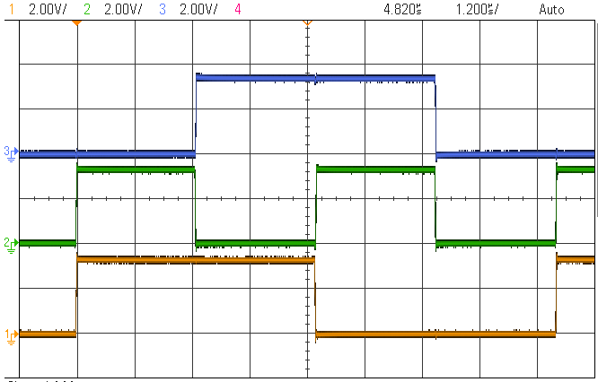

  <article class="markdown-body entry-content p-3 p-md-6" itemprop="text">

# PIC18F47Q10: Getting started with the CLC on PIC18 -> Using Basic Logic Gates -> Bare metal code

## Objective:
The PIC18F47Q10 features 8 Configurable Logic Cell (CLC) peripherals that cen be used to implemenmt various logic functions.
In this demo, the internal timers and PWMs are used to generate internal signals that are then connected to CLCs to implement basic logic gates.
Three use cases are implemented : AND, OR and XOR.

## Resources:
- Technical Brief Link [(linkTBD)](http://www.microchip.com/)
- MPLAB® X IDE 5.30 or newer [(microchip.com/mplab/mplab-x-ide)](http://www.microchip.com/mplab/mplab-x-ide)
- MPLAB® XC8 2.10 or newer compiler [(microchip.com/mplab/compilers)](http://www.microchip.com/mplab/compilers)
- PIC18F47Q10 Curiosity Nano [(DM182029)](https://www.microchip.com/Developmenttools/ProductDetails/DM182029)
- [PIC18F47Q10 datasheet](http://ww1.microchip.com/downloads/en/DeviceDoc/40002043D.pdf) for more information or specifications.

## Hardware Configuration:

The PIC18F47Q10 Curiosity Nano Development Board [(DM182029)](https://www.microchip.com/Developmenttools/ProductDetails/DM182029) is used as the test platform.

The following configurations must be made for this project:
- Timer 2 frequency = 100 kHz (10 us period)
- Timer 4 frequency = 200 kHz (5 us period)
- PWM3 has as source Timer2 and duty-cycle = 50%
- PWM4 has as source Timer4 and duty-cycle = 50%
- CLC1 is set up as AND-OR: used as 2 input OR
- CLC2 is set up as 4-input AND: used as 2 input AND
- CLC3 is set up as OR-XOR: used as 2 input XOR

I/O configurations:
- RA2 pin - Configured output 
- RA3 pin - Configured output 
- RC2 pin - Configured output 
- RC3 pin - Configured output 
- RB0 pin - Configured output 

This setup will create an internal connection as depicted:

## Demo:
Run the code written in Bare metal, the following signals are to be seen on the oscilloscope:

In the figure below it is depicted the input and output signals of CLC1, as it performs the OR logic function:
- Signal 1 (Yellow) is PWM3 output used as CLC1 Input A
- Signal 2 (Green) is PWM4 output used as CLC1 Input B
- Signal 3 (Blue) is CLC1 output (logic OR between PWM3 and PWM4)

In the figure below it is depicted the input and output signals of CLC2 as it performs the AND logic function:
- Signal 1 (Yellow) is PWM3 output used as CLC2 Input A
- Signal 2 (Green) is PWM4 output used as CLC2 Input B
- Signal 4 (Red) is CLC2 output (logic AND between PWM3 and PWM4)

In the figure below it is depicted the input and output signals of CLC3 as it performs the XOR logic function:
- Signal 1 (Yellow) is PWM3 output used as CLC3 Input A
- Signal 2 (Green) is PWM4 output used as CLC3 Input B
- Signal 3 (Blue) is CLC3 output (logic XOR between PWM3 and PWM4)

